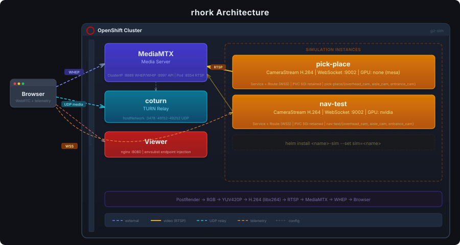

# rhork

A distributed robotics simulation platform that runs isolated [Gazebo Sim](https://gazebosim.org/) instances with live camera streaming to a browser via WebRTC. Built on **Gazebo Sim 11 (Kilimanjaro)**, simulations run headless on Kubernetes/OpenShift with optional GPU acceleration, while a shared media infrastructure handles video relay, NAT traversal, and a web-based viewer with real-time telemetry.

## Why

Robotics simulation is compute-heavy, latency-sensitive, and typically locked to a single workstation. rhork moves simulation to the cluster so that:

- Each simulation gets its own isolated environment with dedicated resources
- Camera feeds stream to any browser with sub-second latency via WebRTC
- Shared infrastructure (media server, TURN relay, viewer) is deployed once
- Sims scale independently - spin up a new one with a single Helm install
- Fuel model caches persist across restarts so large worlds don't re-download

## Architecture

<p align="center">
  
</p>

Video capture and encoding are handled by the [gz-camera-stream](https://github.com/TODO/gz-camera-stream) plugin, a world-level Gazebo system plugin that hooks into the render loop, encodes frames with libx264, and pushes H.264 to MediaMTX via RTSP or WHIP. Each simulation's streams are namespaced (e.g. `pick-place/overhead_cam`, `nav-test/aisle_cam`) so they coexist on the shared media server without collision.

### Components

| Component | Helm Chart | Count | Purpose |
|-----------|-----------|-------|---------|
| **coturn** | `charts/coturn` | 1 | TURN relay for WebRTC UDP traversal through the cluster boundary |
| **MediaMTX** | `charts/mediamtx` | 1 | Media server - ingests H.264 from Gazebo pods, serves WebRTC/HLS to browsers |
| **Viewer** | `charts/viewer` | 1 | nginx serving the web UI with runtime-injected endpoints |
| **Gazebo Sim** | `charts/gz-sim` | N | Headless simulation with the camera streaming plugin |

Shared services (coturn, MediaMTX, viewer) are deployed once per namespace. Simulation instances are spun up as independent Helm releases.

## Genesis AI Integration

In addition to Gazebo Sim, rhork supports Genesis AI as an alternative physics backend. Genesis enables exploration of differentiable physics workflows for robotics research and learning-based control:

- **Differentiable Physics** - Native automatic differentiation through the physics solver for gradient-based optimization
- **Flexible Robot Definitions** - Python API for rapid iteration on morphologies and control schemes
- **Fast Physics** - Configurable solvers with performance optimized for control loops and learning

### Why Genesis?

| Aspect | Gazebo Sim | Genesis AI |
|--------|-----------|-----------|
| Physics Solvers | Rigid body (ODE, Bullet) | Multiple solvers + autodiff |
| Robot Definition | SDF files (XML) | Python API (flexible) |
| Rendering | OpenGL/OGRE | Rasterizer/RayTracer |
| Differentiable Physics | No | Yes (native autograd) |
| Performance | ~1000 Hz | ~500-1000 Hz (solver dependent) |

### Running Genesis

Genesis simulations are deployed the same way as Gazebo Sim instances - as isolated Helm releases on Kubernetes. The shared infrastructure (MediaMTX, coturn, viewer) remains the same:

```bash
# Create namespace
oc new-project genesis-sim

# Deploy shared services (same as Gazebo)
helm install mediamtx ./charts/mediamtx \
  --set coturn.host=<node-ip>

helm install viewer ./charts/viewer \
  --set mediamtx.base=https://mediamtx-genesis-sim.apps.<cluster> \
  --set mediamtx.api=https://mediamtx-api-genesis-sim.apps.<cluster>

# Deploy a Genesis simulation instance
helm install arm-demo ./charts/genesis-sim \
  --set sim=arm-demo \
  --set world=arm_reaching
```

### Genesis Worlds

Worlds are defined in Python (.gen files) for maximum flexibility. This enables rapid iteration on environment configurations, custom object placement, and dynamic world properties:

- `headless_camera.gen` - Minimal test scene with camera for encoding pipeline verification
- `quadcopter_demo.gen` - X3 UAV with velocity control and autonomous patrol
- `arm_reaching.gen` - 7-DOF arm reaching task with target objects and rewards
- `warehouse.gen` - Procedural small warehouse with shelves, walls, obstacles, and three surveillance cameras (ported from Gazebo SDF)

### Learning with Genesis

Genesis exposes the physics state and solver through a Python API, making it ideal for training learning-based controllers. Gradients flow through the physics for trajectory optimization and policy learning. See `arm_reaching_demo.py` for an example of trajectory optimization and `rl_training_example.py` for reinforcement learning workflows.

### Container Images

Genesis simulation is packaged similarly to Gazebo, with a single container image supporting CPU and GPU modes:

```bash
podman build -t quay.io/<org>/genesis-sim-streamer:latest -f Containerfile.genesis .
podman push quay.io/<org>/genesis-sim-streamer:latest
```

### Known Limitations

- Viewer not available on Windows (WebRTC/browser compatibility)
- Python interpreter adds ~10-20% overhead compared to compiled C++ solvers
- Telemetry streaming not yet implemented (video works, topic tree coming in next release)

## Viewer

The viewer is a single-file web UI that connects to both MediaMTX (for WebRTC video) and each Gazebo instance's WebSocket server (for gz-transport telemetry). It provides:

- **WebRTC video playback** via WHEP with automatic ICE/TURN negotiation
- **Topic tree** with type-based filtering and icons for all published gz-transport topics
- **Live telemetry cards** - specialized renderers for Pose, Odometry (attitude indicator + altitude sparkline), Clock, WorldStatistics, CameraInfo, Twist, and a generic key-value fallback
- **Stream control** - click a camera in the sidebar to start/stop encoding on demand
- **Simulation selector** - connect to any running sim for topic browsing and telemetry

Encoding is demand-driven: streams activate when a viewer requests them and stop when all viewers disconnect, so idle cameras use zero encoding resources.

## GPU support

A single container image supports CPU-only, NVIDIA, and AMD GPUs. GPU selection happens at the pod level through Helm values:

| Mode | `gpu.vendor` | What happens |
|------|-------------|-------------|
| CPU-only | `none` | Mesa llvmpipe software rendering. No GPU hardware required. |
| NVIDIA | `nvidia` | Sets `runtimeClassName: nvidia`, requests `nvidia.com/gpu: 1`. Requires NVIDIA GPU Operator on the cluster. |
| AMD | `amd` | Requests `amd.com/gpu: 1`, adds video group. Requires AMD GPU device plugin on the cluster. |

## Quick start

### Prerequisites

- Kubernetes or OpenShift cluster with Helm v3
- `oc` or `kubectl` CLI authenticated
- Container images built and pushed (see [Building images](#building-images))
- For GPU: NVIDIA GPU Operator or AMD device plugin installed

### Deploy shared services

```bash
# Create namespace
oc new-project gz-sim

# TURN relay
helm install coturn ./charts/coturn

# Media server (set coturn.host to the node IP where coturn is running)
helm install mediamtx ./charts/mediamtx \
  --set coturn.host=<node-ip>

# Web viewer (set the MediaMTX route URLs for your cluster)
helm install viewer ./charts/viewer \
  --set mediamtx.base=https://mediamtx-gz-sim.apps.<cluster> \
  --set mediamtx.api=https://mediamtx-api-gz-sim.apps.<cluster>
```

### Spin up a simulation

```bash
# Warehouse world (default)
helm install pick-place ./charts/gz-sim --set sim=pick-place

# Quadcopter demo with GPU
helm install nav-test ./charts/gz-sim \
  --set sim=nav-test \
  --set world=quadcopter_demo \
  --set gpu.vendor=nvidia

# Custom world file
oc create configmap dock-world --from-file=my_world.sdf
helm install dock-sequence ./charts/gz-sim \
  --set sim=dock-sequence \
  --set customWorldConfigMap=dock-world \
  --set world=my_world
```

### Access

```bash
# Open the viewer
open https://viewer-gz-sim.apps.<cluster>

# Shell into a simulation pod
oc rsh deploy/pick-place-gazebo
```

### Teardown

```bash
helm uninstall pick-place                    # Remove one sim (PVC is retained)
helm uninstall viewer mediamtx coturn        # Remove shared services
oc delete pvc pick-place-fuel-cache          # Remove retained PVC if desired
```

## Helm charts

### coturn

TURN server for WebRTC NAT traversal. Deployed with `hostNetwork: true` so it binds directly to the node's network stack, avoiding NodePort range-mapping issues for UDP relay ports. An init container discovers the node's external IP via the Kubernetes downward API and injects it into `turnserver.conf`.

Key values:

| Value | Default | Description |
|-------|---------|-------------|
| `credentials.username` | `gzsim` | TURN authentication username |
| `credentials.password` | `gzsimpass` | TURN authentication password |
| `ports.listening` | `3478` | TURN signaling port |
| `ports.minRelay` / `maxRelay` | `49152` / `49252` | UDP relay port range |

### mediamtx

[MediaMTX](https://github.com/bluenviron/mediamtx) media server. Gazebo pods push H.264 streams here via RTSP or WHIP. Browsers connect via WHEP for WebRTC playback or fall back to HLS. Streams are namespaced by simulation name (e.g. `pick-place/overhead_cam`).

When coturn is configured, MediaMTX includes the TURN server in ICE candidates so WebRTC works through NAT/firewalls.

Key values:

| Value | Default | Description |
|-------|---------|-------------|
| `coturn.host` | `""` | Node IP where coturn is running (enables TURN relay) |
| `coturn.port` | `3478` | TURN server port |

Exposes two services: `mediamtx-webrtc` (port 8889) for WHEP/WHIP signaling and `mediamtx-api` (port 9997) for the stream listing API.

### viewer

nginx serving the viewer web UI. Endpoint URLs are injected at container startup via environment variables so the same image works across clusters.

Key values:

| Value | Default | Description |
|-------|---------|-------------|
| `mediamtx.base` | `""` | Public MediaMTX URL for WHEP playback |
| `mediamtx.api` | `""` | Public MediaMTX API URL for stream discovery |

### gz-sim

Gazebo simulation instance. The `sim` value is required and controls stream namespacing, route naming, and resource labeling.

Key values:

| Value | Default | Description |
|-------|---------|-------------|
| `sim` | `""` | **Required.** Simulation name for isolation and stream namespacing. |
| `world` | `small_warehouse` | SDF world file name from `/worlds/` |
| `gpu.vendor` | `none` | GPU mode: `none`, `nvidia`, or `amd` |
| `gazebo.bitrate` | `4000000` | H.264 encoding bitrate (bps) |
| `gazebo.fps` | `30` | Encoding framerate |
| `persistence.enabled` | `true` | Create a PVC for the Gazebo Fuel model cache |
| `persistence.keep` | `true` | Retain PVC on `helm uninstall` |
| `persistence.size` | `5Gi` | Fuel cache PVC size |
| `customWorldConfigMap` | `""` | ConfigMap containing a custom SDF world file |

## Building images

### gz-sim-streamer

Multi-stage build on UBI 10. Compiles the CameraStream plugin in the build stage, copies the shared library and world files into a minimal runtime image with Mesa drivers for all GPU modes.

```bash
podman build -t quay.io/<org>/gz-sim-streamer:latest -f Containerfile.gazebo .
podman push quay.io/<org>/gz-sim-streamer:latest
```

### gz-viewer

nginx on UBI 10 minimal. Copies `viewer.html` as a template and runs `envsubst` at startup to inject MediaMTX endpoint URLs.

```bash
podman build -t quay.io/<org>/gz-viewer:latest -f Containerfile.viewer .
podman push quay.io/<org>/gz-viewer:latest
```

## Worlds

### small_warehouse.sdf (default)

Amazon small warehouse environment, ported from the [AWS RoboMaker Small Warehouse World](https://github.com/aws-robotics/aws-robomaker-small-warehouse-world) (MIT-0 license). Includes shelves, pallet jacks, boxes, buckets, and clutter arranged in a realistic warehouse layout. Three fixed surveillance cameras provide streaming coverage:

- `overhead_cam` - ceiling-mounted, looking straight down at the warehouse floor
- `aisle_cam` - shelf-height view down a main aisle between shelving units
- `entrance_cam` - corner-mounted wide-angle view of the warehouse entrance

The original Classic Gazebo (SDF 1.6) world has been adapted for Gazebo Sim 11 with rhork system plugins, camera sensors, and updated model definitions.

### quadcopter_demo.sdf

X3 UAV quadcopter with velocity control, three cameras (front 1280x720, downward 640x480, tower overview 1280x720), ground objects, and a landing pad. Run `fly_patrol.sh` inside the pod for an autonomous rectangular patrol pattern.

```bash
helm install nav-test ./charts/gz-sim --set sim=nav-test --set world=quadcopter_demo
```

### headless_camera.sdf

Minimal test scene with a spinning arm, falling shapes, and a single static camera. Good for verifying the encoding pipeline without the overhead of a full world.

## Networking

### Routes (OpenShift)

| Route | Target | Purpose |
|-------|--------|---------|
| `mediamtx.apps.<cluster>` | mediamtx-webrtc:8889 | WHEP video signaling, HLS fallback |
| `mediamtx-api.apps.<cluster>` | mediamtx-api:9997 | Stream listing API |
| `viewer.apps.<cluster>` | gz-viewer:8080 | Web UI |
| `gz-<sim>.apps.<cluster>` | `<sim>-gazebo:9002` | Gazebo WebSocket (telemetry) |

WebSocket routes use the `haproxy.router.openshift.io/timeout: 300s` annotation for long-lived connections.

coturn uses `hostNetwork` and binds directly to node ports - no Route or Ingress needed.

### Stream path convention

All stream paths follow the pattern `<sim>/<camera_name>`. The `STREAM_PREFIX` environment variable (set by the Helm chart to the sim name) is prepended automatically by the CameraStream plugin. This means multiple simulations can use identical world files with identical camera names and their streams won't collide.

## Roadmap

This is the initial deployment infrastructure. Planned work includes:

- Multi-robot coordination across simulation instances
- Shared world state for collaborative scenarios
- ROS 2 bridge integration for control pipeline testing
- Automated CI/CD for world file validation
- Cluster autoscaling policies for simulation workloads
- Recording and replay of simulation sessions

## License

Apache License 2.0
