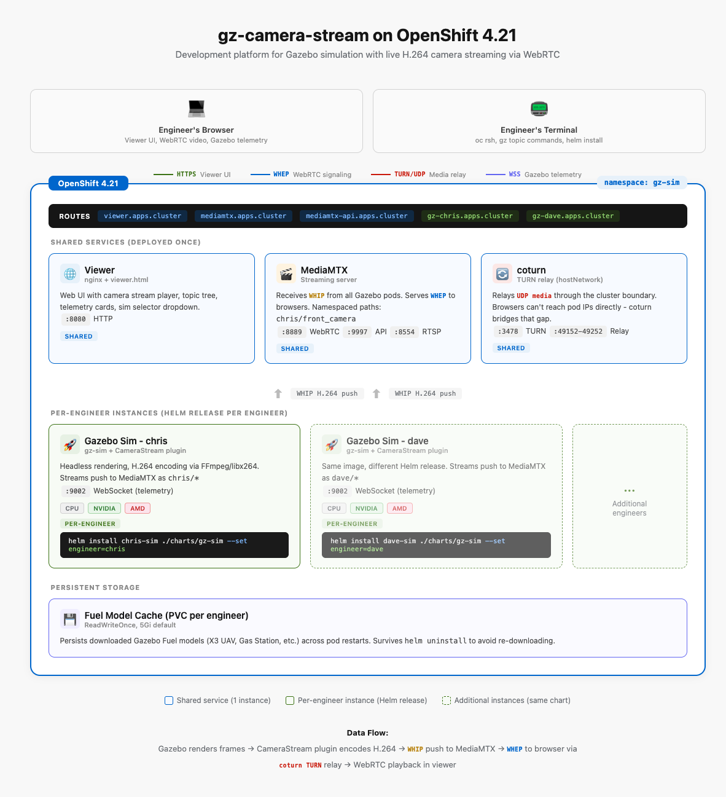

# RHORB - Red Hat OpenShift Robotics Bridge

A deployment platform that runs [Gazebo](https://gazebosim.org/) robotics simulations on OpenShift and streams live camera video to browsers via WebRTC. Engineers get isolated simulation instances they can access from anywhere with a web browser - no local Gazebo install required.



## The Problem

Gazebo is the standard simulator for robotics development, but running it requires a local workstation with GPU drivers, Gazebo packages, FFmpeg, and a media server. This creates several issues for teams:

- **Environment inconsistency** - every engineer's local setup is slightly different, leading to "works on my machine" problems
- **GPU dependency** - not every developer has a workstation with GPU rendering capability
- **No remote access** - you can't share a running simulation with a teammate or view it from a laptop
- **Manual setup** - standing up the full pipeline (Gazebo + MediaMTX + viewer) requires coordinating multiple processes locally

## The Solution

RHORB deploys the entire Gazebo camera streaming pipeline on OpenShift as a shared development platform. The architecture has two layers:

**Shared services** (deployed once per namespace):
- **MediaMTX** - streaming server that receives RTSP from Gazebo pods and serves WebRTC to browsers
- **coturn** - TURN relay that bridges WebRTC UDP media through the OpenShift network boundary
- **Viewer** - web UI for watching camera streams, browsing Gazebo topics, and viewing telemetry

**Per-engineer simulation instances** (one Helm release per engineer):
- Each engineer gets their own Gazebo pod running headless with the [gz-camera-stream](https://github.com/ccustine/gz-camera-stream) plugin
- Streams are namespaced (e.g., `chris/front_camera`, `dave/tower_camera`) so they don't collide on the shared MediaMTX
- GPU mode is selectable at deploy time: CPU-only (Mesa llvmpipe), NVIDIA, or AMD

### Data Flow

```
Gazebo (headless render) -> CameraStream plugin (H.264 via libx264) -> RTSP/TCP -> MediaMTX -> WebRTC (via coturn) -> Browser
```

MediaMTX handles the RTSP-to-WebRTC conversion automatically. The viewer connects to MediaMTX for video and to Gazebo's WebSocket server for telemetry (pose data, world stats, topic tree).

## Quick Start

### Prerequisites

- OpenShift 4.x cluster with `oc` and `helm` CLI tools
- Internal image registry enabled (or an external registry)
- For GPU rendering: NVIDIA GPU Operator or AMD GPU device plugin installed

### 1. Create the namespace and deploy shared services

```bash
oc new-project gz-sim

# Deploy TURN relay (requires hostnetwork SCC for the coturn SA)
oc create serviceaccount coturn -n gz-sim
oc adm policy add-scc-to-user hostnetwork -z coturn -n gz-sim
helm install coturn charts/coturn -n gz-sim

# Deploy MediaMTX (set coturn.host to the node IP where coturn lands)
NODE_IP=$(oc get nodes -l node-role.kubernetes.io/worker \
  -o jsonpath='{.items[0].status.addresses[?(@.type=="InternalIP")].address}')
helm install mediamtx charts/mediamtx -n gz-sim \
  --set coturn.host=$NODE_IP

# Build and deploy the viewer
oc new-build --binary --name=gz-viewer --strategy=docker --to=gz-viewer:latest -n gz-sim
oc patch bc/gz-viewer -n gz-sim --type=json \
  -p '[{"op":"add","path":"/spec/strategy/dockerStrategy/dockerfilePath","value":"Containerfile.viewer"}]'
oc start-build gz-viewer --from-dir=. --follow -n gz-sim

MEDIAMTX_ROUTE=$(oc get route mediamtx -n gz-sim -o jsonpath='{.spec.host}')
MEDIAMTX_API_ROUTE=$(oc get route mediamtx-api -n gz-sim -o jsonpath='{.spec.host}')
helm install viewer charts/viewer -n gz-sim \
  --set image.repository=image-registry.openshift-image-registry.svc:5000/gz-sim/gz-viewer \
  --set image.pullPolicy=Always \
  --set mediamtx.base=https://$MEDIAMTX_ROUTE \
  --set mediamtx.api=https://$MEDIAMTX_API_ROUTE
```

### 2. Build the Gazebo simulation image

The Gazebo image uses the official [Gazebo OCI images](https://github.com/openrobotics/gz_oci_images) as a base since gz-sim RPM packages are not available for RHEL/CentOS. The gz-camera-stream plugin is compiled from source inside the image.

```bash
# Clone the plugin source (needed for the build)
git clone https://github.com/ccustine/gz-camera-stream.git /tmp/gz-plugin

# Copy plugin source into the build context
cp -r /tmp/gz-plugin/src ./src
cp /tmp/gz-plugin/CMakeLists.txt ./CMakeLists.txt

# Build in-cluster
oc new-build --binary --name=gz-sim-streamer --strategy=docker --to=gz-sim-streamer:latest -n gz-sim
oc patch bc/gz-sim-streamer -n gz-sim --type=json \
  -p '[{"op":"add","path":"/spec/strategy/dockerStrategy/dockerfilePath","value":"Containerfile.gazebo"}]'
oc start-build gz-sim-streamer --from-dir=. --follow -n gz-sim
```

### 3. Spin up a simulation

```bash
helm install chris-sim charts/gz-sim -n gz-sim \
  --set engineer=chris \
  --set image.repository=image-registry.openshift-image-registry.svc:5000/gz-sim/gz-sim-streamer \
  --set image.pullPolicy=Always
```

### 4. Open the viewer

```
https://viewer-viewer-gz-sim.apps.<cluster>/?sim=chris
```

Click any camera in the sidebar to start streaming. The viewer connects to Gazebo's WebSocket for telemetry and to MediaMTX for video.

### 5. Control the quadcopter

```bash
# Shell into the Gazebo pod
oc rsh deploy/chris-sim-gazebo -n gz-sim

# Take off
gz topic -t "/X3/gazebo/command/twist" -m gz.msgs.Twist \
  -p "linear: {z: 0.5}"

# Run the patrol
fly_patrol.sh
```

## GPU Support

The Gazebo image includes Mesa drivers for all three modes. GPU selection happens at the pod level via Helm values:

```bash
# CPU-only (default) - Mesa llvmpipe software rendering
helm install sim charts/gz-sim --set engineer=chris

# NVIDIA GPU
helm install sim charts/gz-sim --set engineer=chris --set gpu.vendor=nvidia

# AMD GPU
helm install sim charts/gz-sim --set engineer=chris --set gpu.vendor=amd
```

## Project Structure

```
rhorb/
  Containerfile.gazebo          Gazebo sim image (rotary-full + CameraStream plugin)
  Containerfile.viewer          Viewer web UI image (UBI 10 minimal + nginx)
  nginx.conf                   Non-root nginx config for the viewer
  mediamtx-gazebo.yml           MediaMTX config for local development
  mediamtx-cluster.yml          MediaMTX config template for cluster deployment
  viewer.html                   Web UI (WebRTC player, topic tree, telemetry)
  quadcopter_demo.sdf           Demo world: X3 UAV, 3 cameras, ground objects
  headless_camera.sdf           Minimal test world: spinning arm, static camera
  fly_patrol.sh                 Autonomous flight script for the X3 UAV
  charts/
    coturn/                     TURN relay for WebRTC media (hostNetwork)
    mediamtx/                   MediaMTX streaming server (RTSP/WebRTC/HLS)
    viewer/                     Web viewer (nginx + viewer.html)
    gz-sim/                     Per-engineer Gazebo simulation instance
  docs/
    architecture-diagram.html   Interactive deployment architecture diagram
    architecture-screenshot.png Architecture diagram screenshot
```

## Networking

OpenShift Routes handle HTTP/HTTPS traffic, but WebRTC media flows over UDP. coturn bridges this gap by running with `hostNetwork: true` and relaying UDP media between the browser and MediaMTX.

| Route | Purpose |
|-------|---------|
| `viewer-viewer-gz-sim.apps.<cluster>` | Web UI |
| `mediamtx-gz-sim.apps.<cluster>` | WebRTC signaling (WHEP) |
| `mediamtx-api-gz-sim.apps.<cluster>` | Stream discovery API |
| `gz-<engineer>-gz-sim.apps.<cluster>` | Gazebo WebSocket (telemetry) |

## Teardown

```bash
helm uninstall chris-sim -n gz-sim   # Remove one sim
helm uninstall viewer mediamtx coturn -n gz-sim  # Remove shared services
oc delete project gz-sim             # Remove everything
```

## Related

- [gz-camera-stream](https://github.com/ccustine/gz-camera-stream) - The Gazebo plugin that encodes camera frames to H.264 and pushes to MediaMTX
- [MediaMTX](https://github.com/bluenviron/mediamtx) - Media server handling RTSP/WebRTC/HLS conversion
- [Gazebo OCI Images](https://github.com/openrobotics/gz_oci_images) - Official container images used as the base for the sim image
